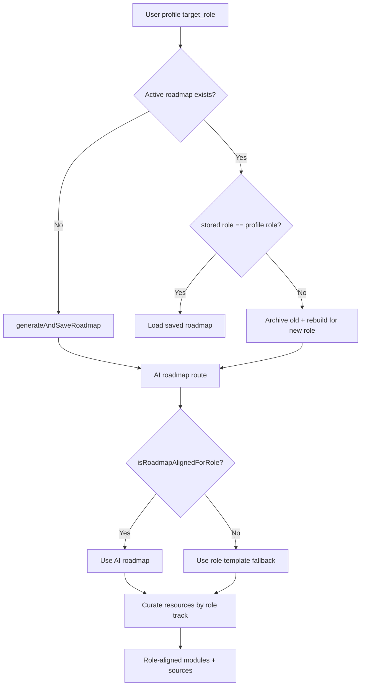

# Role ↔ Learning Module Alignment Audit

Status: Passed
Date: 2026-06-23
Scope: Verify that the learning roadmap and its curated sources (videos, docs,
quizzes, projects) always match the role the user selected, and never serve
"ngawur" (mismatched) modules.

## Question

When a user picks a target role (e.g. Frontend Developer), do they receive a
learning path and learning sources that genuinely belong to that role — and does
the path rebuild itself if the user changes role later?

## Method

- Traced the role value from the user profile through roadmap generation and
  resource curation.
- Reviewed the alignment guards in the AI roadmap route and the resource
  relevance engine.
- Ran the content validator: `npm run validate:roadmap`.

## Findings

### 1. Role is the single source of truth

`target_role` is read from the Supabase profile (falling back to the local
onboarding profile) and threaded into every generation call:

- [app/roadmap/page.tsx](../app/roadmap/page.tsx) resolves `targetRole` then calls
  the AI route, falling back to `generateFallbackRoadmap({ targetRole, ... })`.
- Each role has a dedicated, hand-authored fallback track in
  [lib/ai/fallback-roadmap.ts](../lib/ai/fallback-roadmap.ts)
  (`FRONTEND_FALLBACK`, `BACKEND_FALLBACK`, `FULLSTACK_FALLBACK`,
  `UI_ENGINEER_FALLBACK`, `MOBILE_FALLBACK`, `DATA_ANALYST_FALLBACK`) plus a
  role-specific `finalPortfolioProject`.

### 2. AI output is rejected if it drifts from the role

[app/api/ai/roadmap/route.ts](../app/api/ai/roadmap/route.ts) does not trust the
LLM blindly. `isRoadmapAlignedForRole()` enforces per-role rules:

- Required topic clusters must all appear (e.g. a Frontend roadmap must cover
  internet basics, HTML/CSS, JS/TS, React, Tailwind, Next.js/deploy).
- Forbidden keywords are capped (e.g. a Frontend roadmap may not be built around
  `bcrypt`, `prisma migration`, `express controller`, `postgresql schema`).
- Beginner milestones must appear in a sensible order.

If the AI response fails these checks, the route discards it and serves the
role-correct template instead. This makes a mismatched module structurally
impossible to reach the user.

### 3. Curated sources are filtered by role

[lib/roadmap/resources.ts](../lib/roadmap/resources.ts) curates videos/docs per
task and gates them with `isResourceLikelyRelevant()` /
`getCuratedResourcesForTask()`, which:

- Infer a role "track" for the task and prefer contract-bound resource keys.
- Apply `FRONTEND_ONLY_HINTS` vs `BACKEND_HINTS` guards so, e.g., a backend task
  does not surface a pure-frontend video (and vice versa).

### 4. Role drift rebuilds the path automatically

When the active roadmap's stored `context.targetRole` differs from the user's
current profile role, [app/roadmap/page.tsx](../app/roadmap/page.tsx) archives the
old roadmap and rebuilds a role-aligned one (and re-curates its resources).



### 5. Automated validation

`npm run validate:roadmap` passes: **6 roles, 165 tasks** validated for content
contract compliance. This runs as part of `npm run validate`.

## Conclusion

The learning module and its sources are correctly bound to the selected role at
generation time, defended by alignment guards, re-checked on role change, and
covered by an automated validator. No mismatched ("ngawur") module path can reach
the user through the supported flow.

## How to re-verify

```bash
npm run validate:roadmap          # content contract, all roles
npm run audit:roadmap-matrix      # print the per-role task matrix
```
