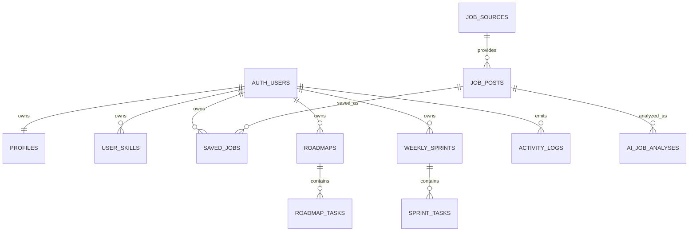

# Database Schema

SkillPath uses Supabase Postgres with Row Level Security for user-owned data.

## Core Entities



## Role Model

`profiles.role` is an enum:

- `user`: default learning dashboard access.
- `admin`: operational dashboard access.

Admin promotion must happen through trusted SQL or a server-side service-role operation.

```sql
update public.profiles
set role = 'admin'
where id = '<auth-user-uuid>';
```

## Row Level Security

User-owned tables keep owner policies:

- `profiles`
- `user_skills`
- `saved_jobs`
- `roadmaps`
- `roadmap_tasks`
- `weekly_sprints`
- `sprint_tasks`
- `activity_logs`

Phase 1 adds admin read policies using `private.is_admin()`. The helper function lives outside the exposed `public` schema and is executable by authenticated users only for policy evaluation.

## Client Update Boundary

Authenticated clients can update editable profile fields, but not `profiles.role`.

Editable profile fields:

- `full_name`
- `target_role`
- `current_level`
- `goal`
- `study_time`
- `github_username`
- `onboarding_completed`
- `updated_at`

## Migration Notes

`002_add_auth_roles.sql` is additive:

- Creates `public.app_role` if missing.
- Adds `profiles.role` with default `user`.
- Adds `idx_profiles_role`.
- Adds admin read policies.
- Restricts client profile updates from changing `role`.

Rollback plan for local development:

1. Drop admin policies created by `002_add_auth_roles.sql`.
2. Drop `private.is_admin()`.
3. Drop `profiles.role`.
4. Drop `public.app_role` if no data depends on it.

Production rollback should be forward-only unless profile role reads are removed from deployed application code first.
