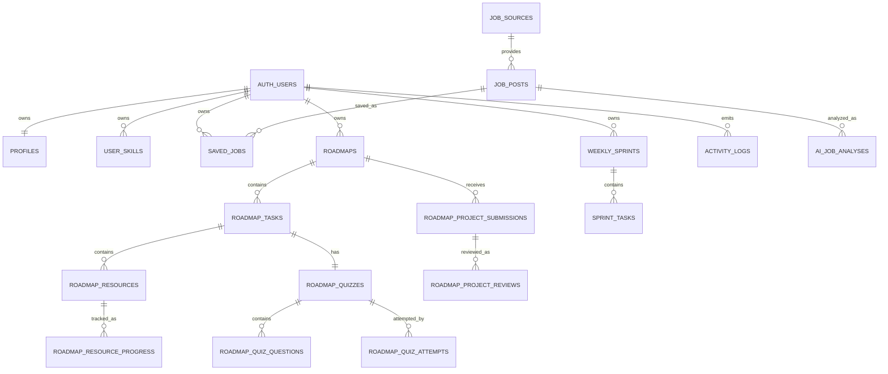

# Database Schema

SkillPath uses Supabase Postgres with Row Level Security for user-owned data.

## Core Entities



## Role Model

`profiles.role` is an enum:

- `user`: default learning dashboard access.
- `admin`: operational dashboard access.

Admin promotion must happen through trusted SQL or a server-side service-role operation.

```sql
update public.profiles
set role = 'admin'
where id = '<auth-user-uuid>';
```

## Row Level Security

User-owned tables keep owner policies:

- `profiles`
- `user_skills`
- `saved_jobs`
- `roadmaps`
- `roadmap_tasks`
- `roadmap_resources`
- `roadmap_resource_progress`
- `roadmap_quizzes`
- `roadmap_quiz_questions`
- `roadmap_quiz_attempts`
- `roadmap_project_submissions`
- `roadmap_project_reviews`
- `weekly_sprints`
- `sprint_tasks`
- `activity_logs`

Phase 1 adds admin read policies using `private.is_admin()`. The helper function lives outside the exposed `public` schema and is executable by authenticated users only for policy evaluation.

Public job data uses RLS too:

- `job_sources`: anonymous and authenticated users can select enabled sources.
- `job_posts`: anonymous and authenticated users can select only fresh `approved` or `pending_review` jobs.
- `job_ingestion_runs`: admin read only.

## Client Update Boundary

Authenticated clients can update editable profile fields, but not `profiles.role`.

Editable profile fields:

- `full_name`
- `target_role`
- `current_level`
- `goal`
- `study_time`
- `github_username`
- `onboarding_completed`
- `updated_at`

## Migration Notes

`002_add_auth_roles.sql` is additive:

- Creates `public.app_role` if missing.
- Adds `profiles.role` with default `user`.
- Adds `idx_profiles_role`.
- Adds admin read policies.
- Restricts client profile updates from changing `role`.

Rollback plan for local development:

1. Drop admin policies created by `002_add_auth_roles.sql`.
2. Drop `private.is_admin()`.
3. Drop `profiles.role`.
4. Drop `public.app_role` if no data depends on it.

Production rollback should be forward-only unless profile role reads are removed from deployed application code first.

`005_roadmap_persistence.sql` is additive:

- Adds `roadmaps.is_active`, `roadmaps.archived_at`, and `roadmaps.context`.
- Adds task ordering, week metadata, mini exercise state, deliverable state, and task `updated_at`.
- Adds `roadmap_resources` and `roadmap_resource_progress`.
- Enables RLS for public job source/post reads and admin ingestion-run reads.
- Recreates roadmap/job policies with `DROP POLICY IF EXISTS` + `CREATE POLICY` so reruns stay idempotent.
- Adds job freshness indexes, `job_posts.last_seen_at`, and a source/external ID dedupe index.
- Adds AI job analysis cache fields for suggested skills, comparison notes, source, and `updated_at`.

Rollback plan for local development:

1. Remove application code that reads resource tables and new roadmap columns.
2. Drop `roadmap_resource_progress` and `roadmap_resources`.
3. Drop policies added for job public reads and roadmap resources.
4. Drop additive columns only after the app no longer depends on them.

Production rollback should be forward-only. Archive old roadmaps instead of deleting them when regenerating.

`006_learning_assessment_system.sql` is additive:

- Adds roadmap task requirement-state columns for quiz/project gating.
- Adds `roadmaps.final_project_passed` and `roadmaps.final_project_status`.
- Adds quiz persistence tables: `roadmap_quizzes`, `roadmap_quiz_questions`, `roadmap_quiz_attempts`.
- Adds project submission/review tables: `roadmap_project_submissions`, `roadmap_project_reviews`.
- Enables RLS and owner-scoped policies for attempts/submissions/reviews.
- Keeps quiz correct-answer storage server-side for submission grading.

Rollback plan for local development:

1. Remove app code that reads quiz/project assessment tables and requirement-state columns.
2. Drop quiz/project policies and tables.
3. Drop additive task/roadmap columns only after app code no longer references them.

Production rollback should be forward-only; prefer soft migration corrections over destructive rollback.
