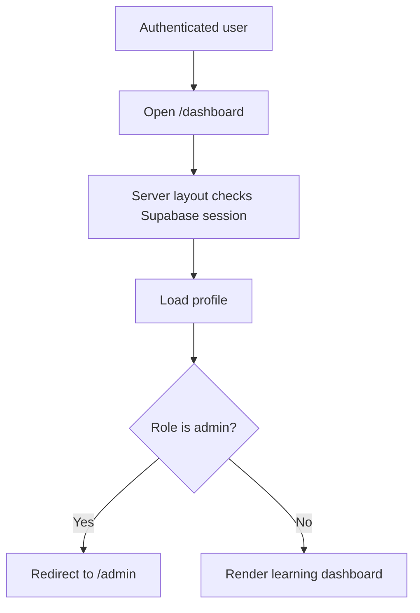
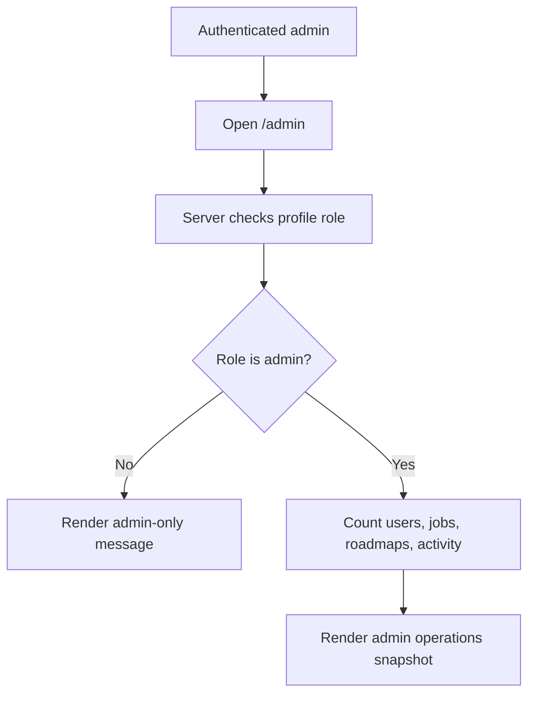
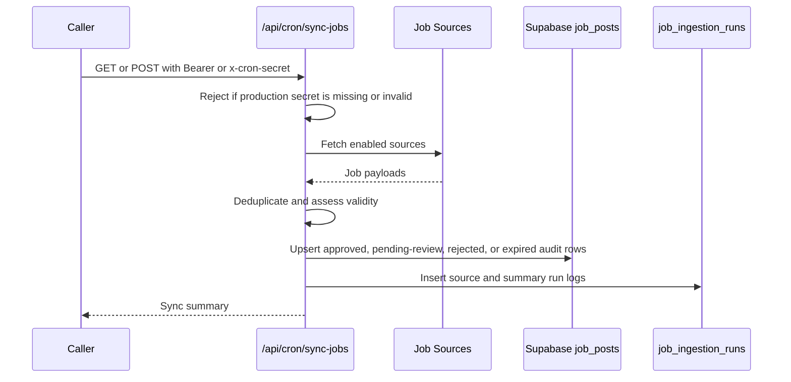
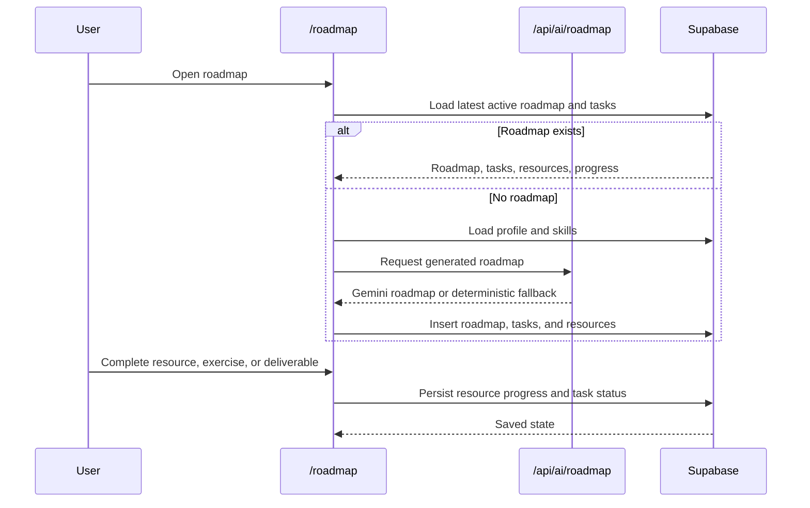
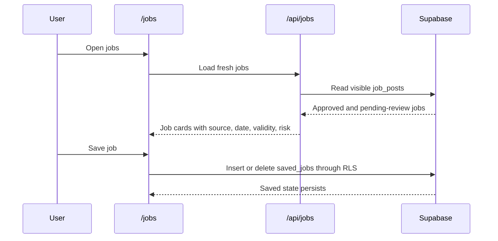

# Flow Overview

## Main Application Flow

```mermaid
flowchart TD
  A[Visitor opens SkillPath] --> B{Supabase configured?}
  B -- No --> C[Demo mode surfaces render]
  B -- Yes --> D{Verified session?}
  D -- No --> E[Protected dashboard state]
  D -- Yes --> F[Load profiles row]
  F --> G{profiles.role}
  G -- user --> H[/dashboard user progress view]
  G -- admin --> I[/admin operations view]
```

## User Dashboard Flow



## Admin Dashboard Flow



## Cron Sync Flow



## Roadmap Persistence Flow



## Saved Jobs Flow


